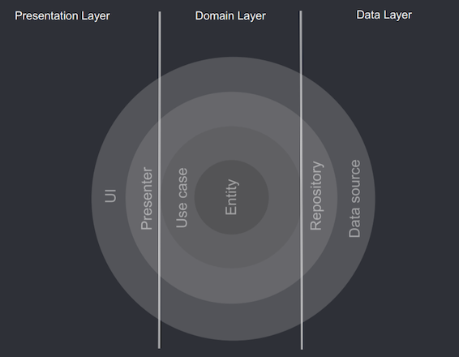

#  ![alt text] Dog Breeds
------------------

## 🛠️ Built With

* [Kotlin](https://kotlinlang.org/)
* [Jetpack](https://developer.android.com/jetpack)
* [XML Layouts](https://developer.android.com/guide/topics/ui/declaring-layout)
* [Ktor](https://ktor.io/)
* [Picasso](https://github.com/square/picasso)
* [Hilt](https://dagger.dev/hilt/)
* [JUnit4](https://github.com/junit-team/junit4)
* [Mockk](https://mockk.io)
* [Room](https://developer.android.com/jetpack/androidx/releases/room)

------------------

## 📐 Module Architecture

This project is based on concepts of Clean Architecture, and the layers were divided as below:

### 📖 Domain Layer

> The most INNER part of the circle, it contains **Entities, Use cases, Services Interfaces and Repositories Interfaces**.

* **Entity**: A data class that represents a Business Model and all its attributes Ex: (A Group, User or Message)
* **Use Case**: Defines the application behavior; It is responsible for executing every application rule and return data, throw errors, all the application logic resides in use cases; A use case have an Input and/or Output data class.
  1. _**Use Case Interface**: Protocol mainly used for Mocking Test behavior._
  2. _**Use Case Implementation**: Implementation itself of all the logic._
* **Services protocols**: Protocols that defines the behavior of an API service.
* **Repository protocols**: Protocols that defines the behavior of a Database repository.

### 📦 DataSource Layer

> Contains **Services and Repository implementations**.

* **Services Implementations**: Services Implementations implements Services Protocols from Domain Layer, in here that you will implement your HTTP, WebSocket code, etc ...
* **Repository Implementations**: Repository Implementations implements Repository Protocols from Domain Layer; In here that you will implement your Room, SharedPreferences, FileManager code, etc...

>`🔃 DataSource Layer depends on Domain Layer.`

### 🎨 Presentation Layer

> Contains **UI** of every screen, View, Controllers, ViewModels. 
> Every screen is structured in MVVM (model, view, and view model).

* **ViewModels**: A class that is responsible for call actions that can be made on a screen and holds the view state and receive data from UseCases to format it to present in the View.
* **Model**: A data class that represents all possible states that a screen can have Ex: (List, Errors, Loading Status)
* **View**: A Fragment view itself, that observe a ViewModel state and calls ViewModel actions.

>`🔃 Presentation Layer depends on Domain.`

### 🎨 App Layer

> Contains **SETUP** of the entire app, Injections, Application, Core Activity. 

------------------

## 🧪 Tests ##

### Unit tests
> All classes of all layers are testable,

- Domain layer has **Use Cases** unit tests that validate its behaviour.
- Data source layer has **Services** and **Repositories** tests that validate mapping, data error, service specific errors, unexpected results...
- Presentation layer has **View Models** tests that validates entry data, formatting data, actions calls...

### Driven Development
> In this assignment the features were driven by tests. (TDD)  
> With this discipline we can prevent unexpected behaviours and develop faster with shorter cycles.

## TODOs and Notes to Shape Games
I started the development testing and trying to predict the possible errors and behaviours, but I didn't have time to finish all the tests. 
You can see the TODOs in the code and the notes in the README.md file.
I had started this assignment on the `FetchImageLinks`, so in there you can see the tests that I had done.
Also in the DataSource layer `BreedsHttpService` you can see the tests that I had done.

My main focus in this assignment was to show my knowledge in the architecture and the tests, so I didn't have time to finish the UI and the tests.
It lacks a lot of improvements in the UI, but I think that the architecture and the tests are the most important things in this assignment.

Thank you for reviewing my code, I hope that you like it. 😄